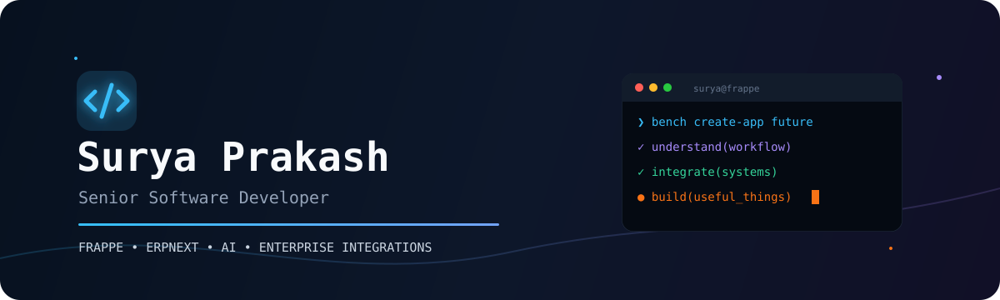

<div align="center">
  
</div>

<div align="center">

[](https://www.linkedin.com/in/rsuryaprakash)
[](mailto:suryaviper3@gmail.com)

</div>

## `whoami`

I'm **Surya Prakash**, a **Senior Software Developer** who turns complex business workflows into focused, dependable software.

My home ground is the **Frappe Framework and ERPNext**—designing custom applications, integrations, reports, automations, and industry-specific workflows that make ERP fit the business, rather than forcing the business to fit the ERP.

```python
surya = {
    "role": "Senior Software Developer",
    "craft": ["Frappe", "ERPNext", "Business Automation", "Integrations"],
    "currently_building": [
        "an AI chatbot native to the Frappe ecosystem",
        "an SAP-to-Frappe migration and integration toolkit",
    ],
    "philosophy": "Understand the workflow. Simplify it. Automate what remains.",
}
```

## What I build

<table>
  <tr>
    <td width="50%" valign="top">
      <h3>🧩 ERP that fits</h3>
      Custom Frappe and ERPNext applications shaped around real operational workflows—from manufacturing, stock, and HR to portals and reporting.
    </td>
    <td width="50%" valign="top">
      <h3>🔌 Systems that talk</h3>
      Practical integrations spanning enterprise systems, banking and payments, messaging, biometric devices, and external APIs.
    </td>
  </tr>
  <tr>
    <td width="50%" valign="top">
      <h3>🤖 AI inside the workflow</h3>
      Building conversational AI as a native part of Frappe—where assistants can work with business context instead of living in a separate tab.
    </td>
    <td width="50%" valign="top">
      <h3>🔄 SAP × Frappe</h3>
      Developing migration tooling for schema discovery, source-data exploration, controlled migration runs, validation, and traceable errors.
    </td>
  </tr>
</table>

## My engineering orbit

<div align="center">


</div>

## The trail so far

```text
business need
    └── workflow discovery
         └── Frappe / ERPNext design
              ├── custom apps & reports
              ├── portals & automations
              ├── payments & external APIs
              └── AI + enterprise integrations  ← building here now
```

<div align="center">
  
  
</div>

---

<div align="center">
  <strong>Have a complicated workflow?</strong><br />
  That's usually where the interesting engineering begins.<br /><br />
  <a href="mailto:suryaviper3@gmail.com">Let's build something useful.</a>
</div>

